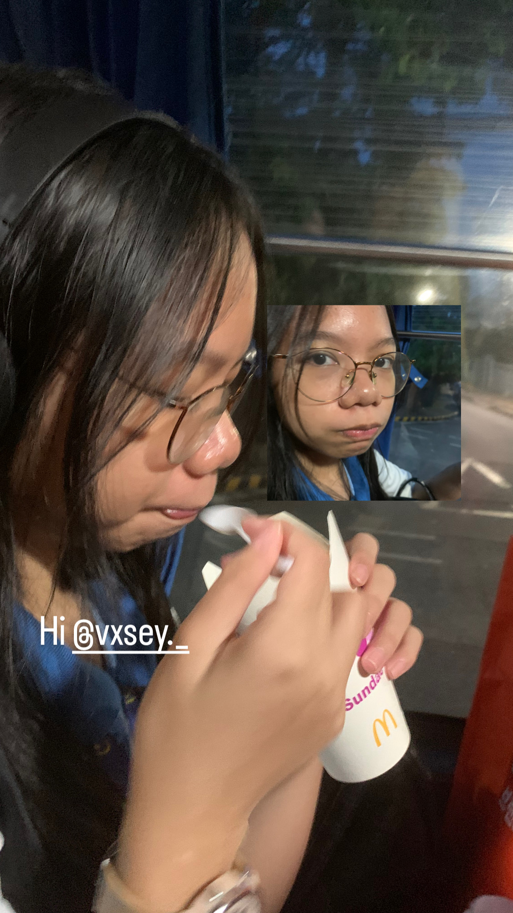

<!DOCTYPE html>
<html lang="en">
<head>
  <meta charset="UTF-8">
  <meta name="viewport" content="width=device-width, initial-scale=1.0">
  <title>For You ☆</title>

  
</head>

<body>

  <!-- PAGE 1 -->
  <section class="page active" id="page1">
    
☆

    <h1>Waddup!</h1>

    

      I made a little somethingsomething 
      happi beryrtdayay
    

    <button onclick="nextPage()">Next →</button>
  </section>

  <!-- PAGE 2 -->
  <section class="page" id="page2">

    <h1>Happy Birthday! ♡</h1>

    

      Today is your special day, 
      so I wanted to make something 
      a little different for you since different ka talaga.
    

    <button onclick="nextPage()">Next →</button>
  </section>

  <!-- PAGE 3 -->
  <section class="page" id="page3">

    <h2>Pictures📸 (YUNG MGA PHOTOS KO SAYO PALAGING MAY KASAMA OK) </h2>

    

      <!-- CHANGE THESE TO YOUR PHOTOS -->
      
      
    

    <button onclick="nextPage()">Next →</button>
  </section>

  <!-- PAGE 4 -->
  <section class="page" id="page4">

    <h1>For you</h1>

    

      

        Dear liway,  

        I just wanted to say how grateful I am
        to have you in my life. You deserve all
        the happiness in the world, and I hope
        this year brings you lots of good memories,
        laughter, and moments you'll never forget. 
        (seryoso yarn??) joke sorry but fr,
        you've been so wonderful and a supportive friend to me
        and I can't thank you enough for that. Side note : gaga tama na 
        sa mga bobong lalaki na yan umayos ka.
          

        Thank you for being you. ☆
          

        Happy birthday!
      

    

    <button onclick="nextPage()">Next →</button>
  </section>

  <!-- PAGE 5 -->
  <section class="page" id="page5">

    
☆

    <h1>One last thing...</h1>

    

      Open mo to..♡ pramis wala tong virus. ata
    

    

      <button onclick="yes()">Open it ☆</button>
      <button id="noBtn" onclick="moveNo()">No ty</button>
    

  </section>

  <!-- PAGE 6 -->
  <section class="page" id="page6">

    
☆

    <h1>YAY!</h1>

    

      I hope you liked it. ☆  
      Happy birthday once again!
      oo pinapress ko lang sayo para sa wala or may virus na talaga...
    

    <button onclick="restart()">Start again</button>
  </section>

  

</body>
</html>
